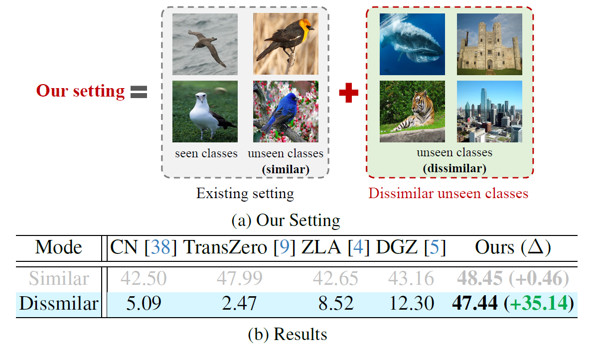

# Improving Generalized Zero-Shot Learning by Exploring the Diverse Semantics from External Class Names
<div align="center">

[Yapeng Li](https://scholar.google.com/citations?user=kkuoU8oAAAAJ&hl=zh-CN), [Yong Luo](https://scholar.google.com/citations?user=zb1oVGIAAAAJ&hl=zh-CN&oi=ao), [Zengmao Wang*](https://scholar.google.com/citations?user=tTqiJpQAAAAJ&hl=zh-CN&oi=ao), [Bo Du*](https://scholar.google.com/citations?user=Shy1gnMAAAAJ&hl=zh-CN)

</div>

<a href='https://openaccess.thecvf.com/content/CVPR2024/html/Li_Improving_Generalized_Zero-Shot_Learning_by_Exploring_the_Diverse_Semantics_from_CVPR_2024_paper.html'></a>
[](https://youtu.be/0ob-YYMEFDI?si=CR1fGbUXW5-r1Pfa)
[](https://colab.research.google.com/drive/1fXEb5xekpa_ykPxj55r6Mb4hyL9F4MGB?usp=drive_link)

## 📝 Introduction
 Generalized Zero-Shot Learning (GZSL) methods **often assume that the unseen classes are similar to seen classes, which leads to poor performance when unseen classes are dissimilar to seen classes**. In this project, we introduce a simple yet effective GZSL framework by exploring diverse semantics from external class names (**DSECN**), which is **robust for both the similar and dissimilar unseen classes**.
This is achieved by introducing diverse semantics from external class names and aligning the introduced semantics to visual space using the classification head of pre-trained network. Additionally, we show that **the design idea of DSECN can easily be integrated into other advanced GZSL approaches**, and enhance their robustness for dissimilar unseen classes.

<div style="text-align:center">

</div>

#### 🌟Compared to existing works, main contributions are:

- **Setting:** A realistic GZSL setting that includes both **similar and dissimilar** unseen classe.
- **Model:** A simple and effective GZSL method that explores Diverse Semantics from External ClassNames (DSECN), which is **robust for both similar and dissimilar** unseen classes.
- **Plug-and-Play:** The idea of DSECN can be **easily integrated into other GZSL methods, enhancing their robustness** for dissimilar unseen classes._
- **Evaluation Pipeline:** A **cross-dataset evaluation pipeline** designed to comprehensively assess the performance of existing GZSL methods across similar, dissimilar, and practical settings.

## 🚀 Getting Started

### Installation

```sh
conda env create -f environment.yml
```

### Data Preparation

The dataset can download [Google Drive](https://drive.google.com/uc?id=1Gy3dvusCumvTcQ4uUg9W1EkWrkNca6Ak) and [BaiduNetdisk](https://pan.baidu.com/s/1fyKRMxUqCW8UKhxGyCxzjw?pwd=zjoo).


```
data
└── AWA2/
    ├── clip_splits.mat 
    ├── w2v_wiki_en_splits.mat
    ├── res101_useweight.mat
    └── att_splits.mat
    ...
└── CUB/
    ├── clip_splits.mat 
    ├── w2v_wiki_en_splits.mat
    ├── res101_useweight.mat
    └── att_splits.mat
    ...
└── SUN/
    ├── clip_splits.mat 
    ├── w2v_wiki_en_splits.mat
    ├── res101_useweight.mat
    └── att_splits.mat
    ...
└── ExternalClass/  
    ├── clip_splits_1k.npy
    ├── clip_splits_hypoclass.npy
    ├── w2v_wiki_en_splits_1k.npy
    └── w2v_wiki_en_splits_hypoclass.npy
```

### Download pretrained ResNet Weight
The pretrained weight can download [here (pytorch models)](https://download.pytorch.org/models/resnet101-5d3b4d8f.pth). The pretrained weight is placed in the pretrained_models folder.
```
pretrained_models
└──resnet101-5d3b4d8f.pth
```


**Training:**
```
python train_DSECN_pipeline.py --att_type 'clip' --seed 58 --train_dataset 'CUB' --use_DSE --use_HTE
python train_DSECN_pipeline.py --att_type 'clip' --seed 58 --train_dataset 'AWA2' --use_DSE --use_HTE
python train_DSECN_pipeline.py --att_type 'clip' --seed 58 --train_dataset 'SUN' --use_DSE --use_HTE

python train_DSECN_pipeline.py --att_type 'w2v' --seed 10 --train_dataset 'CUB' --use_DSE --use_HTE
python train_DSECN_pipeline.py --att_type 'w2v' --seed 58 --train_dataset 'AWA2' --use_DSE --use_HTE
python train_DSECN_pipeline.py --att_type 'w2v' --seed 58 --train_dataset 'SUN' --use_DSE --use_HTE
```
**Intergrating DSECN into ClassNorm:**
```
python train_CN_pipeline.py --att_type 'clip' --train_dataset 'CUB'
python train_CN_pipeline.py --att_type 'clip' --train_dataset 'CUB' --use_DSECN
python train_CN_pipeline.py --att_type 'clip' --train_dataset 'AWA2'
python train_CN_pipeline.py --att_type 'clip' --train_dataset 'AWA2' --use_DSECN
python train_CN_pipeline.py --att_type 'clip' --train_dataset 'SUN'
python train_CN_pipeline.py --att_type 'clip' --train_dataset 'SUN' --use_DSECN
```

## Main Results
<div style="text-align:center">

</div>


## Citation	

If you use our work in your research, please cite: 

```
@InProceedings{Li_2024_CVPR,
    author    = {Li, Yapeng and Luo, Yong and Wang, Zengmao and Du, Bo},
    title     = {Improving Generalized Zero-Shot Learning by Exploring the Diverse Semantics from External Class Names},
    booktitle = {Proceedings of the IEEE/CVF Conference on Computer Vision and Pattern Recognition (CVPR)},
    month     = {June},
    year      = {2024},
    pages     = {23344-23353}
}
```

## Contact
For any questions on this project, please contact [Yapeng Li (yapengli@whu.edu.cn)](yapengli@whu.edu.cn).

## Acknowledgement
The code is built upon [ClassNorm](https://github.com/universome/class-norm.git), we thank all the contributors for open-sourcing.